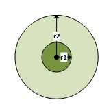
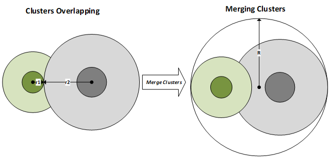
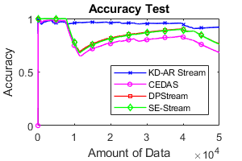
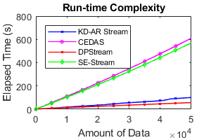

# Python-Implementation-of-KD-AR-Stream

This is python implementation of KD-AR Stream clsutering algorithm.
  
<b>Purpose:</b>  The aim of this article is to propose a new data stream clustering algorithm that has an adaptive
radius, can adapt itself to the evolutionary structure of streaming data, and works in a fully online manner.  

<b>Theory and Methods:</b> 
The method we propose basically receives its power from Kd-trees that support multidimensionality. Kd-trees are utilized 
in the processes of forming a new cluster and splitting the existing clusters. The process of range search with a determined 
radius (r) is performed on data placed into the tree. Two kinds of radius values are kept in the KD-AR Stream: 
The distance of the farthest element of the cluster to the gravity center of the cluster (C_Radius).
The average standard deviation in all dimensions (C_Std) and it is used to decide whether or not the clusters will be merged. 
  
 
Fig. 1. Types of radii used in KD-AR Stream.  
The proposed method supports the evolution of data streams, as mentioned in the E-Stream algorithm. In the E-Stream algorithm, 
there are five types of evolution. These are the appearance of a new cluster, the disappearance of an existing cluster, the 
splitting of an existing cluster to two clusters, the merging of two clusters, and the self-evolution of a cluster. In our 
approach, we support the inactivation of an active cluster and reactivation of an inactive cluster instead of its disappearance 
(deletion). Figure 6 provides an outline of the KD-AR Stream. We can sum up the evolutionary steps of the proposed model as follows: 
	1. Appear: If a sufficient amount of data, which is sufficiently far away from all clusters, is formed in the light 
 of newly received data, forming a new cluster by combining them; 
	2. Activation-Inactivation: If the amount of data in an active cluster drops below the threshold value, this cluster 
 is inactivated. On the contrary, an inactive cluster is reactivated if the number of elements exceeds the threshold value 
 when a new element is added to it; 
	3. Merge: If the distances between centers of two or more clusters drop below the predetermined threshold value, these 
 clusters merge (See Figure 3);  
	4. Split: If a sufficient amount of data in an active cluster has a sufficient distance from the center of the cluster, 
 this cluster is split; 
	5. Self-evolution: Behaviors of an existing cluster like radius, owned data, and position can change over time according 
 to the evolution of the data stream. Our approach adapts to evolution quickly. 
   
Fig. 2. An example of merge operation.  

<b>Results:</b> 
To verify the effectiveness of the KD-AR Stream algorithm, it is compared with SE-Stream, DPStream, and
CEDAS on a variety of well-known datasets in terms of clustering quality and run-time complexity. The results
show that KD-AR Stream outperforms other algorithms with a higher clustering success in a reasonable time,
as shown in Fig. 3. 

 
  
Fig 3. Comparison of KD-AR Stream results with its competetors. 
  
<b>Conclusion:</b> 
The aim of this study is to propose a novel data stream clustering algorithm that adapts to the dynamic structure
of the streaming data. The aim is achieved by using the five evolutionary processes which are appearance,
activation/inactivation, self-evolution, merge, and split. According to the results, the proposed method is very
successful in terms of clustering quality and run-time complexity. 
  
<b>Code Usage:</b> 
Ex: 
dataset = np.loadtxt("Datasets/ExclaStar.txt", dtype=float,delimiter=',')
X=dataset[:,1:3]
labels_true=dataset[:,3]
dataset_name="2_ExclaStar"
#Parameters
N= 9
TN= 59
r= 0.4
r_threshold= 0.08
r_max= 0.53
####MinMaxNormalization#######################################################
scaler = MinMaxScaler()
scaler.fit(X)
MinMaxScaler()
X=scaler.transform(X) 

kds=KDARStream(X,N,TN,r,r_threshold,r_max,X.shape[1],plot)
labels=kds.labels_
labels_true=labels_true.reshape(len(labels))

ARI=adjusted_rand_score(labels_true, labels)
Purity=kds.purity_score(labels_true, labels)
Silhouette=silhouette_score(X,labels)

#Print results: 
print("ARI=",ARI)
print("Purity=",Purity)
print("Silhouette=",Silhouette)

  
If you use the code, please cite the article shared below:  
Şenol, A. & Karacan, H. (2020). K-boyutlu ağaç ve uyarlanabilir yarıçap (KD-AR Stream) tabanlı gerçek zamanlı akan veri kümeleme . Gazi Üniversitesi Mühendislik Mimarlık Fakültesi Dergisi , 35 (1) , 337-354 . DOI: <a href="https://doi.org/10.17341/gazimmfd.467226" target="_blank">10.17341/gazimmfd.467226</a>
